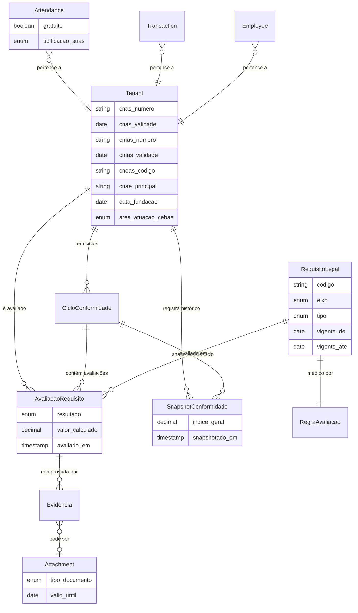

# Arquitetura — Motor de Conformidade Contínua (Vivensi)
> Fase 4 | 2026-07-21 | Proposta de desenho — nenhum código de produção aqui

---

## 4.1 Modelo de Domínio

### Decisões arquiteturais centrais

**1. Catálogo de requisitos: tabela em banco, seed por migration**
Não arquivos PHP nem config. Razão: requisitos precisam ser consultáveis (filtrar por eixo, risco, tipo), e o histórico precisa ser preservado. Uma avaliação feita em 2026 deve continuar refletindo a regra vigente em 2026, mesmo que a lei mude em 2027. Solução: campos `vigente_de` e `vigente_ate` em `RequisitoLegal`. Ao alterar a lei, cria-se um novo registro — o antigo não é deletado.

**2. Cálculo: híbrido — sob demanda + job semanal + invalidação por evento**
- Tipo A: calculado na hora em que o tenant abre o dashboard (rápido, só para aquele tenant). Resultado cacheado por 24h.
- Invalidação: quando `Attendance`, `Transaction` ou `Attachment` são criados/alterados, um evento dispara `RecalcularConformidadeJob` para aquele tenant (queue `default`, curto).
- Job semanal: varre todos os tenants ativos e recalcula + gera `SnapshotConformidade`. Nunca calcula tudo sincronicamente para centenas de tenants — sempre individual na fila.

**3. Onde entra e onde NÃO entra o BruceIA**
- ✅ Entra: explicar em linguagem simples o que está pendente, redigir minutas de relatório, sugerir próximos passos, responder dúvidas sobre os requisitos
- ❌ Não entra: decidir se um requisito foi cumprido. Isso é determinístico (Tipo A) ou humano com assinatura (Tipo B/C). IA nunca muda o resultado de uma `AvaliacaoRequisito`

---

### Entidades do domínio

**`RequisitoLegal`** — catálogo global (sem tenant_id)
```
id, codigo (ex: CEBAS-AS-002), eixo (cebas_geral/cebas_as/mrosc/suas)
area (as/saude/educacao/geral), titulo, enunciado, base_legal
tipo (A/B/C), periodicidade (continua/mensal/anual/por_ciclo)
risco (alto/medio/baixo), vigente_de (date), vigente_ate (date nullable)
ativo (boolean)
```

**`RegraAvaliacao`** — como cada requisito é medido (1:1 com RequisitoLegal)
```
id, requisito_legal_id
# Para Tipo A (calculável):
modelo (ex: 'attendances'), campo_filtro (ex: 'gratuito'), 
formula (percentual/existencia/contagem/soma), threshold (decimal), 
threshold_tipo (minimo/maximo/igual), unidade (ex: '%')
# Para Tipo B (documental):
tipo_documento_obrigatorio (enum — cnd_inss/crf_fgts/cnd_federal/cnas_inscricao/...)
alerta_dias_antes (int, ex: 30)
# Para Tipo C (declaratório):
pergunta_declaracao (text), requer_anexo (boolean)
```

**`CicloConformidade`** — janela de certificação por tenant (com BelongsToTenant)
```
id, tenant_id, eixo (cebas/mrosc/suas)
data_inicio (date), data_fim (date)
enquadramento (3_anos/5_anos/anual/por_parceria)
status (em_andamento/encerrado/renovado)
observacoes (text)
```

**`AvaliacaoRequisito`** — resultado por tenant × ciclo × requisito (com BelongsToTenant)
```
id, ciclo_conformidade_id, requisito_legal_id, tenant_id
resultado (verde/amarelo/vermelho/nao_aplicavel)
valor_calculado (decimal nullable — para Tipo A: o percentual ou contagem)
avaliado_em (timestamp), avaliado_por (user_id nullable — null = calculado pelo sistema)
observacoes (text nullable)
```

**`Evidencia`** — vínculo polimórfico entre avaliação e comprovação
```
id, avaliacao_requisito_id
evidenciavel_type (Attachment/AttendanceAggregate/Declaration)
evidenciavel_id (bigint)
tipo (calculado/documento/declaracao)
descricao (text nullable)
```

**`SnapshotConformidade`** — foto periódica do índice (com BelongsToTenant)
```
id, tenant_id, ciclo_conformidade_id
indice_geral (decimal 5,2), indice_cebas (decimal), indice_suas (decimal), indice_mrosc (decimal)
total_verde, total_amarelo, total_vermelho, total_nao_aplicavel (int)
snapshotado_em (timestamp)
```

---

### Diagrama do modelo de dados (Mermaid)



---

### Novos campos em tabelas existentes

```
attendances:     + gratuito (boolean, default false)
                 + tipificacao_suas (enum nullable: paif/scfv/peti/paefi/abordagem_social/acolhimento/outros)

attachments:     + tipo_documento (enum nullable: estatuto/ata/cnd_inss/crf_fgts/cnd_federal/
                                   cnas_inscricao/cmas_inscricao/cneas_registro/parecer_auditoria/
                                   balanco_patrimonial/relatorio_atividades/plano_trabalho/
                                   prestacao_contas/outros)
                 + valid_until (date nullable)
                 + versao (int default 1)
                 + substituido_por_id (bigint nullable FK → attachments.id)

tenants:         + cnas_numero, cnas_validade, cmas_numero, cmas_validade
                 + cneas_codigo, cnae_principal, data_fundacao
                 + area_atuacao_cebas (enum: as/saude/educacao/multipla)
                 + receita_bruta_anual_ref (decimal — para trigger de auditoria)

employees:       + categoria_profissional (enum: assistente_social/psicologo/pedagogo/
                                           advogado/contador/outros)

transactions:    + elegivel_mrosc (boolean default false)
                 + fonte_recurso (enum nullable: proprio/cebas/suas/mrosc/doacao/outro)

ngo_grants:      + modalidade (enum: fomento/colaboracao/termo_parceria)
                 + numero_instrumento (string nullable)
                 + orgao_concedente_codigo (string nullable)

project_stages:  + executed_value (decimal nullable)
```

---

## 4.2 Interface (Filament 3 + Livewire 3)

### Dashboard de Conformidade (`/ngo/conformidade`)

**Widget 1 — Semáforo por eixo**
```
[ CEBAS/AS  🟢 82% ] [ SUAS  🟡 61% ] [ MROSC  🔴 45% ]
Ciclo CEBAS: 847 dias restantes (renovação em 15/09/2028)
```

**Widget 2 — Pendências acionáveis (ordenadas por risco × prazo)**
```
🔴 ALTO   CND/INSS vence em 12 dias                    → [Renovar] [Upload]
🔴 ALTO   Percentual de gratuidade: 14,3% (mínimo 20%) → [Ver atendimentos]
🟡 MÉDIO  RMA de junho não foi enviado                 → [Gerar relatório]
🟡 MÉDIO  Inscrição CMAS não cadastrada                → [Preencher dados]
```

**Widget 3 — Evolução do índice (gráfico de linha)**
Histórico do `SnapshotConformidade.indice_geral` — últimos 12 meses.

**Widget 4 — Documentos vencendo (próximos 60 dias)**
Lista de `Attachment` com `valid_until` no horizonte.

---

### Página de Detalhamento por Eixo (`/ngo/conformidade/cebas-as`)

- Lista todos os requisitos do eixo com resultado atual
- Para cada requisito: resultado (verde/amarelo/vermelho), evidência vinculada, ação sugerida
- Tipo A: mostra o valor calculado e o threshold
- Tipo B: mostra o documento vinculado, validade, botão de upload
- Tipo C: mostra checklist com botão de declaração + campo de assinatura responsável

---

### Integração com Navegação existente
- Adicionar item "Conformidade" no menu lateral (role: admin/manager — não employee)
- Badge numérico com total de itens vermelhos no ícone do menu
- No dashboard principal: widget compacto com índice geral + 1 pendência crítica

---

### Upload de Documentos com Validade
- Modal de upload: tipo de documento (select) + data de validade + arquivo
- Validação: PDF/DOCX, max 10MB (consistente com Attachment existente)
- Após upload: vincula automaticamente ao `AvaliacaoRequisito` correspondente via tipo_documento → RegraAvaliacao

---

### Gerador de Dossiê
- Botão "Gerar Dossiê de Renovação CEBAS"
- Dispara job em fila → PDF compilado com: dados da organização, ciclo, todas as avaliações verdes, evidências por requisito, assinaturas declaratórias
- Notifica via WhatsApp/email quando o PDF estiver pronto

---

## 4.3 Automação

### Jobs e Eventos

**`RecalcularConformidadeJob`**
- Disparado por: `AttendanceCreated`, `AttendanceUpdated`, `TransactionCreated`, `AttachmentCreated`
- Queue: `default` (curto — só recalcula Tipo A para aquele tenant)
- Invalida cache do dashboard

**`AlertaDocumentoVencendoJob`** (agendado diariamente às 08:00)
- Varre `attachments` com `valid_until` nos próximos 60 dias
- Envia WhatsApp + email ao admin do tenant: "Sua CND/INSS vence em 12 dias"
- Silencia por 7 dias após notificação (evita fadiga)

**`SnapshotConformidadeJob`** (agendado semanalmente, domingo 03:00)
- Para cada tenant ativo com ciclo em andamento:
  - Calcula todos os Tipo A
  - Agrega resultados
  - Persiste `SnapshotConformidade`
- Processa na fila um tenant de cada vez — não em massa síncrona

**`GerarDossieJob`**
- Disparado por ação do usuário no dashboard
- Compila PDF com barryvdh/dompdf (já instalado)
- Salva em `storage/app/private/tenants/{id}/dossies/`
- Notifica usuário via broadcast + WhatsApp

---

### Alertas — Estratégia anti-fadiga

| Tipo de alerta | Canal | Frequência máxima |
|---|---|---|
| Documento vencendo (60 dias) | Email | 1x por semana |
| Documento vencendo (30 dias) | Email + WhatsApp | 1x por semana |
| Documento vencendo (7 dias) | WhatsApp | Diário |
| Documento vencido | WhatsApp | 1x a cada 3 dias |
| Índice geral caiu > 10% | Email | 1x por evento |
| RMA mensal não enviado (dia 8) | WhatsApp | 1x por mês |

---

## 4.4 Segurança, LGPD e Isolamento

### Isolamento de tenant em jobs e commands
- Todos os novos models (exceto RequisitoLegal) com `BelongsToTenant`
- Jobs recebem `tenant_id` explícito no construtor — mesmo padrão dos jobs existentes
- Scheduler (`SnapshotConformidadeJob`): itera sobre `Tenant::where('subscription_status', 'active')` e despacha job individual por tenant

### Perfis e permissões
| Ação | admin | manager | employee |
|---|---|---|---|
| Ver dashboard de conformidade | ✅ | ✅ | ❌ |
| Fazer declaração (Tipo C) | ✅ | ❌ | ❌ |
| Upload de documentos | ✅ | ✅ | ❌ |
| Gerar dossiê | ✅ | ❌ | ❌ |
| Ver RequisitoLegal (catálogo) | ✅ | ✅ | ❌ |

### Trilha de auditoria (Tipo C — crítico)
- Toda declaração persiste: `user_id`, `timestamp`, texto exato da declaração, IP
- Usa `\App\Traits\Auditable` (já existe) em `AvaliacaoRequisito`
- Declarações não podem ser editadas — apenas uma nova declaração substitui (imutabilidade)

### Retenção de documentos
- Documentos de conformidade: retenção mínima = ciclo de certificação + 5 anos
- Soft delete apenas — nunca hard delete automático para `tipo_documento != null`
- Aviso ao usuário antes de deletar documento com `tipo_documento` preenchido
